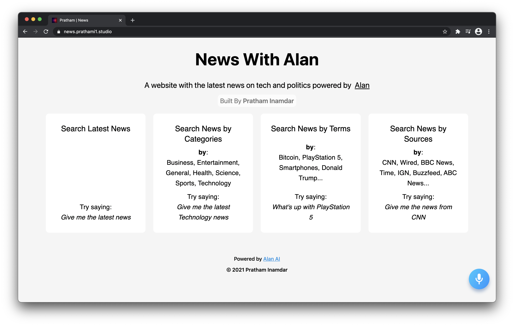
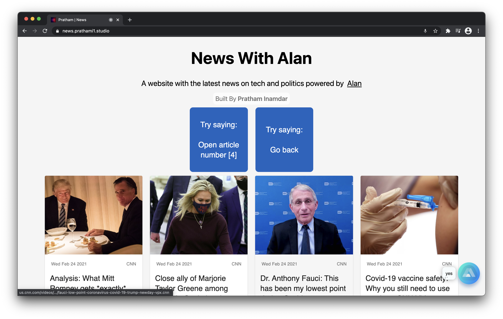
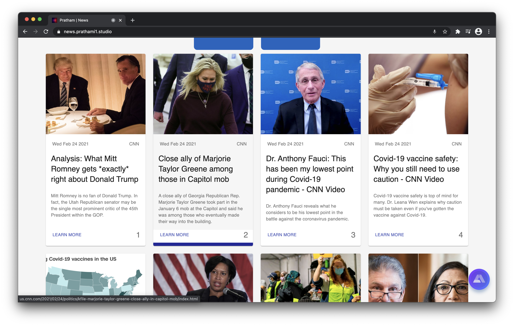

# News
A React web application that displays news articles by category, terms, and sources. Receives all input via voice commands, implementing Alan AI for voice query user interaction. 

## How it works
This React web application utilizes material UI for design purposes, informing users about the App's functionality at their first glance. After they ask Alan (the small little circle in bottom right corner) what type of news they want, Alan converts them into parameters to fetch the relevant news from. After displaying that fetched news to the user via the front end portion of the application, Alan prompts the user if they want him to read the title out loud, go back to the main screen, open a specific article, etc. After the user says their command, Alan repeats the process mentioned above.

## Application in action
Here is an example of the application's greeting page, where it informs the user of its commands.

Here is an example of Alan in action, doing live speech-to-text conversion in real time, fetching the latest news articles from what it heard.

Here is an example of Alan responding to the users voice commands, providing news articles pertaining to their specific voice queries.

Here is an example of Alan reading out the articles' headlines, interacting with the user, like a personal virtual assistant would.

# Dependencies utilized
- React (JS, JSX)
- Alan AI
- CSS
- Material UI
